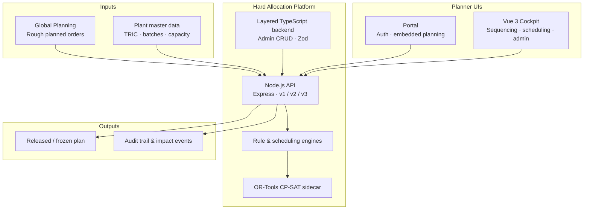

# Hard Allocation Platform

[](https://github.com/schmeckm/pharma_planing_plattform)
[](https://nodejs.org/)
[](https://vuejs.org/)
[](backend/README.md)
[](#license)

**Executable planning layer for pharmaceutical plants** — hard allocation, production sequencing, detailed scheduling, and measurable before/after outcomes per line.

> **Product strategy (canonical):** [docs/PRODUCT_STRATEGY.md](docs/PRODUCT_STRATEGY.md)  
> Fit before purpose · PPS & PPP BPM KPIs · Process + user + AI · Not an OMP/APO replacement

**Repository:** [github.com/schmeckm/pharma_planing_plattform](https://github.com/schmeckm/pharma_planing_plattform)

---

## Overview

Global Planning (IBP, rough-cut network plans) delivers direction — not always an **executable** shop-floor plan. This platform sits between Global Planning and MES/SAP: planners enrich rough orders with plant reality (TRIC, batches, capacity, horizons), run what-if and optimization, and release stable sequences with full auditability.

| Capability | Description |
|------------|-------------|
| **Hard allocation** | 7-tier hierarchy: compliance → availability → market → inventory → performance → optimization → enterprise |
| **Production sequencing** | Gantt with day/shift/hour zoom, drag-and-drop, OR-Tools CP-SAT sidecar, recommended sequence |
| **Detailed scheduling** | Operation-level planning, what-if (OEE, maintenance), horizon-aware rescheduling |
| **Planning impact** | Before/after deltas per line — late orders, utilization, setup, RMSL |
| **Governance** | Versioned rules, exception workflow, risk engine (LOW/MEDIUM/HIGH), GMP audit trail |
| **AI assistance** | Allocation copilot and schedule explanations — human approval, no autopilot |
| **Integration-ready** | `IDataProvider` abstraction (JSON today, SAP OData/RFC path prepared) |

### Strategic positioning

We deliberately **do not** replace SAP IBP/OMP/PP-DS at network level. We deliver an **Executable Planning Layer** at the plant with two BPM north-star KPIs (see [Product Strategy](docs/PRODUCT_STRATEGY.md)):

- **PPS** — Production Plan Stability after release  
- **PPP** — Production Plan Performance vs. actuals after production  

---

## Architecture



| Layer | Location | Role |
|-------|----------|------|
| HTTP API | `server.js`, `routes/`, `controllers/` | REST, Swagger, WebSocket scheduling hub |
| Engines | `engines/` | Allocation, sequencing, exceptions, detailed scheduling |
| Services | `services/` | Orchestration, scheduling facade, planning impact |
| Layered backend | `backend/src/` | TypeScript Controller → Service → Repository (JSON / PostgreSQL-ready) |
| Data | `data/` | JSON prototype store (`HAP_DATA_DIR`) |
| Cockpit | `cockpit/` | Vue 3 planner UI (standalone or portal-embedded) |
| Portal | `portal/` | Auth, profile, planning routes at `/planning/*` |

Full documentation index: [docs/README.md](docs/README.md)

---

## Technology stack

| Layer | Technology |
|-------|------------|
| Runtime | Node.js 20+, Express.js |
| Frontend | Vue 3, Pinia, PrimeVue |
| Validation | Zod (TypeScript backend), Pydantic (OR-Tools worker) |
| Optimization | Google OR-Tools CP-SAT (`scripts/ortools/`) |
| Persistence (MVP) | JSON files via `JsonRepository` |
| Persistence (Phase 2) | PostgreSQL stubs in `backend/` |
| API docs | OpenAPI 3 / Swagger at `/docs` |
| Jobs & agents | BullMQ-ready patterns, LLM agents (OpenAI / Azure) |

---

## Quick start

### Prerequisites

- Node.js 20+
- npm
- Windows: PowerShell (recommended startup script) · Linux/macOS: run equivalent npm commands

### Clone and configure

```bash
git clone https://github.com/schmeckm/pharma_planing_plattform.git
cd pharma_planing_plattform
cp .env.example .env    # optional: LLM keys, SAP provider, OR-Tools URL
npm install
npm run build:backend   # compile TypeScript admin layer (runs automatically on npm start)
```

> **Secrets:** Never commit `.env`. Use `.env.example` as a template only.

### Run modes

| Mode | Command | Use when |
|------|---------|----------|
| **API only** | `npm run dev` | Backend development, Swagger, tests |
| **Cockpit (classic)** | `.\scripts\start.ps1 dev` | Standalone planner UI on port 3001 |
| **Portal (full stack)** | `.\scripts\start.ps1 portal` | Auth + embedded planning at `/planning/*` |
| **Docker** | `docker compose up --build` | Containerized API + cockpit |

Manual cockpit (without script):

```bash
cd cockpit && npm install && npm run dev
```

### Services and URLs

| Service | Default URL | Notes |
|---------|-------------|-------|
| Allocation API (v1) | http://localhost:8000/api/v1 | Core allocation & planning |
| Enterprise API (v2) | http://localhost:8000/api/v2 | Rules, exceptions, mass jobs |
| Agent API (v3) | http://localhost:8000/api/v3 | Morning briefing, LLM agents |
| Swagger UI | http://localhost:8000/docs | OpenAPI |
| Health | http://localhost:8000/health | Live cache & scheduling status |
| Cockpit (standalone) | http://localhost:3001 | Daily wizard, line optimization |
| Portal frontend | http://localhost:5173 | Login + `/planning/detailed-scheduling`, `/planning/line-optimization` |
| OR-Tools sidecar | http://localhost:8010 | Started with `start.ps1 dev` when configured |

**Key planner routes (Portal):**

- Detailed scheduling — `/planning/detailed-scheduling`  
- Line optimization — `/planning/line-optimization`  
- Admin master data — `/planning/admin/data/planning-orders`  

Demo roles (cockpit header): `planner`, `qa`, `supplychain`, `admin`, `viewer`

---

## API highlights

| Method | Endpoint | Description |
|--------|----------|-------------|
| GET | `/api/v1/orders` | Packaging orders |
| POST | `/api/v1/allocation/simulate` | Simulate batch allocation |
| POST | `/api/v1/allocation/execute` | Execute allocation (audited) |
| POST | `/api/v1/planning/optimize-sequence` | Explicit sequence optimization |
| GET | `/api/v1/planning/scheduling-status` | Heuristic vs. OR-Tools availability |
| GET | `/api/v1/admin/data/:slug` | Master data CRUD (layered backend) |
| GET | `/api/v3/agents/morning-briefing` | AI schedule briefing |

Example:

```bash
curl -X POST http://localhost:8000/api/v1/allocation/simulate \
  -H "Content-Type: application/json" \
  -d '{"packagingOrderId":"PO-20001","userId":"API-USER"}'
```

Business rules (configurable via `data/rules.json`): TRIC, RMSL, FIFO, batch split, Japan sequence, quality release, audit trail.

---

## Development

```bash
npm run dev              # API with --watch
npm run dev:all          # PowerShell: backend + cockpit + OR-Tools
npm run build:backend    # TypeScript → backend/dist/
npm run seed             # Seed JSON into HAP_DATA_DIR
npm run reset:demo       # Reset demo environment
npm test                 # Smoke (32) + E2E HTTP (31)
npm run test:smoke       # Backend engines only
npm run test:e2e         # Live API (server must be running)
```

Layered backend details: [backend/README.md](backend/README.md)

Scheduling design: [docs/scheduling/SCHEDULING-SERVICE-DESIGN.md](docs/scheduling/SCHEDULING-SERVICE-DESIGN.md)

---

## Documentation

| Document | Description |
|----------|-------------|
| [Product Strategy](docs/PRODUCT_STRATEGY.md) | Canonical product direction, PPS/PPP, roadmap phases |
| [Roadmap](docs/ROADMAP.md) | Implementation phases (scheduling, OR-Tools, agents, demo data) |
| [Documentation index](docs/README.md) | Full map of all docs |
| [MVP 2.0 Enterprise](docs/mvp2/README.md) | Rules, exceptions, risk, mass allocation |
| [Daily planning cockpit](docs/daily-planning/README.md) | Wizard and daily sequencing |
| [Line optimization](docs/line-optimization/README.md) | Combined planning & Gantt |
| [Enterprise architecture](docs/enterprise/ARCHITECTURE.md) | Platform architecture |
| [GMP compliance](docs/compliance/PHARMACEUTICAL-COMPLIANCE.md) | Pharmaceutical compliance notes |
| [Control tower (MVP 4)](docs/control-tower/README.md) | Global supply chain control tower |
| [AI allocation (MVP 3)](docs/mvp3/README.md) | Multi-agent and knowledge graph |

---

## Project structure

```
.
├── server.js                 # Main Express entry
├── routes/ controllers/      # HTTP layer
├── engines/ services/        # Business logic
├── data/                     # JSON data store
├── backend/                  # TypeScript layered backend
├── cockpit/                  # Vue 3 planner UI
├── portal/                   # Auth + embedded planning shell
├── scripts/                  # start.ps1, OR-Tools, demo data
├── docs/                     # Product & technical documentation
└── swagger/                  # OpenAPI specification
```

---

## License

Proprietary — internal pharmaceutical planning platform. All rights reserved.

## Contributing

Branch from `main`, use clear commit messages, and open a pull request against [origin](https://github.com/schmeckm/pharma_planing_plattform). Do not commit secrets or production data.
