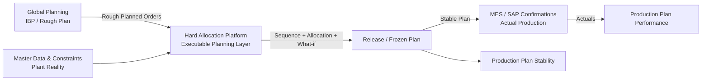

# Product Strategy — Hard Allocation Platform

**Version:** 1.0 · June 2026  
**Audience:** Supply Chain Lead, MRP Controller, Detailed Scheduler, Global Planning (interface), Engineering  
**Status:** Canonical product strategy for GitHub and BPM governance

---

## Executive summary

We are **not** building a heavyweight **OMP/APO/PP-DS** replacement. We build an **Executable Planning Layer** at the plant: planners turn global plans into **executable** shop-floor schedules, improve **measurable outcomes per line** (before/after), and the organization can prove **plan stability** after release and **plan vs. actual performance** after production.

**North star:** *The planning organization delivers a measurable, stable, executable plan — with AI-assisted decisions, not AI autopilot.*

---

## Strategic principles

| Principle | Meaning | What we deliberately avoid |
|-----------|---------|------------------------------|
| **Fit before purpose** | Solution fits the **plant process**, not a full APS suite catalog | Replacing SAP IBP/OMP/PP-DS at network level |
| **Process + user + AI** | Standard work (Daily Wizard); human decides; AI explains and recommends | Autopilot without approval |
| **Outcome per line** | Every session shows visible results: late orders, RMSL, utilization, setup — **per packaging line** | Optimization without before/after delta |
| **Planning org contribution** | MRP controllers / schedulers measured via **before/after** and **impact events** | Black-box solver scores without attribution |
| **Shadow first** | What-if and drafts without production risk; explicit activation | Silent writes to SAP production |

---

## Problem statement: Global Planning plans are often not executable

Global Planning (IBP, rough-cut network plan) typically delivers:

- Rough planned packaging orders (`roughPlannedOrders`) with dates and quantities  
- Aggregated capacity assumptions  
- Little plant reality: TRIC, batch availability, setup chains, maintenance, OEE, QC release  

**Core issue:** The global plan is a **direction**, not an **executable fine plan**.

Our platform sits between Global Planning and the shop floor:



---

## Master data: Global Planning input vs. plant enrichment

To make a rough plan **executable**, the platform must **interpret, enrich, and validate** master data — not pass it through blindly.

### From Global Planning (input)

| Object | Typical fields | Risk if ignored |
|--------|----------------|-----------------|
| Rough planned order | Order, material, qty, line, start/end, country | Dates without capacity / setup |
| Rough capacity | Line × week | Ignores maintenance, OEE, shifts |
| Demand signal | Country, priority | Not linked to TRIC/batch |

### Plant master data (enrichment)

| Domain | Entities | Purpose |
|--------|----------|---------|
| Material | Material, campaign group, color family | Setup, sequencing |
| Capacity | Line, shift calendar, capacity buckets | Finite capacity |
| Regulatory | TRIC cases, inspection lots, batches | Executability |
| Structure | Components, operations, resources | Combined planning |
| Horizons | Planning horizons (Frozen/Fixed/Flexible) | Stability & BPM |
| Ownership | MRP controller, portfolio, detailed scheduler | Attribution |

### Executable check (constraint pipeline)

An order from Global Planning is **executable** only when, among others:

- Batch / ATP / TRIC / RMSL satisfied  
- Line qualified  
- Capacity available in horizon  
- No hard horizon violation (Frozen without override)  

**Product rule:** Every imported rough order shows status `EXECUTABLE` | `AT_RISK` | `BLOCKED` with reasons for planner and AI.

---

## Two BPM core KPIs

These KPIs are **process-driving** (not reporting-only). They connect planning, release, and actuals.

### 1. Production Plan Stability (PPS)

**Question:** How stable is the plan after orders enter detailed scheduling / plant release?

**Definition:** Share of orders that, after a **stability anchor event** (freeze / confirm / activate), experience **no relevant planning changes** until production start (or shift start).

| Element | Specification |
|---------|---------------|
| **Population** | Orders with status `CONFIRMED` / `ACTIVATED` in detailed scheduling or activated plant sequence |
| **Stability anchor** | Timestamp `stabilityAnchorAt` (shadow confirm, activate draft, or frozen horizon entry) |
| **Relevant change** | Start/end, line, quantity, batch assignment, cancellation — **not** comments-only updates |
| **Stable** | No relevant change between anchor and `productionStart` |
| **Unstable** | ≥1 relevant change after anchor |
| **KPI (%)** | `PPS = stable orders / population × 100` |
| **By line** | PPS per `productionLine` |
| **By MRP** | PPS per `mrpController` (material ownership) |

**Target examples (plant-specific):**

| Horizon | Zone | Target PPS |
|---------|------|------------|
| T+0 … T+3 | FROZEN | ≥ 98% |
| T+4 … T+14 | FIXED | ≥ 90% |
| T+15+ | FLEXIBLE | Track only |

**Why BPM matters:** High instability in Frozen = process breakdown (global plan churn, urgent changes, weak governance). PPS is an **early indicator** of planning maturity — not OTIF alone.

**Data sources (target):**

- `planningImpactEvents` / draft activations (anchor time)  
- Audit trail / schedule versions  
- Horizon metadata per order  
- Optional: SAP plan changes after release (Phase 2 integration)  

---

### 2. Production Plan Performance (PPP)

**Question:** Did the plant **produce what was in the released plan**?

**Definition:** Compare **released plan snapshot** vs. **actual production** (MES/SAP) after packaging orders complete.

| Element | Specification |
|---------|---------------|
| **Plan snapshot** | At anchor: order, material, qty, line, planned start/end, batch |
| **Actuals** | Confirmations / GR / packaging postings: actual qty, line, start/end |
| **Quantity match** | `\|actualQty − planQty\| / planQty ≤ tolerance` (e.g. ≤ 2%) |
| **Line match** | Actual line = planned line |
| **Schedule match** | Actual start within tolerance (e.g. ±1 shift) |
| **Material match** | Same FG / correct batch chain |
| **PPP (%)** | `full-match orders / completed orders × 100` |
| **By line / MRP** | Same formula sliced by line and MRP controller |

**Supporting sub-KPIs:**

| Sub-KPI | Formula |
|---------|---------|
| Quantity adherence | actualQty / planQty × 100 |
| Schedule adherence | Share of starts within tolerance |
| Right-first-line | Share on correct line |
| Plan-to-produce gap | Σ \|plan − actual\| quantities |

**Why BPM matters:** PPP closes the **plan → production** loop. Low PPP + high PPS → shopfloor/MES issues. Low PPP + low PPS → planning quality / global plan fit.

**Data sources (target):**

- Released plan: `draftSchedules`, `planningResults`, SAP export  
- Actuals: MES / SAP CO11N (stub: `/integration/mes/confirmations`)  

---

### PPS × PPP maturity matrix

| | Low PPS | High PPS |
|---|---------|----------|
| **Low PPP** | Systemic — unstable plan, poor execution | Shopfloor/MES — stable plan, poor execution |
| **High PPP** | Heroic plant — unstable plan, still delivered | **Target** — stable plan, good execution |

Supply Chain Lead uses this matrix in **monthly BPM review** — not solver metrics.

---

## Supporting KPIs: planning organization contribution (before/after)

During fine planning, the plant needs **operational** metrics (partially implemented today):

| KPI | Meaning | Dimensions | Platform status |
|-----|---------|------------|-----------------|
| Late orders avoided | Fewer late orders | Line, MRP | `PlanningImpactService` |
| RMSL violations reduced | Regulatory risk down | Line, MRP | Implemented |
| Risk score improvement | Aggregate plan risk down | Line, MRP | Implemented |
| OEE / utilization delta | Capacity use | Line | Partial |
| Orders moved | Planning activity | Line, MRP | Implemented |
| Setup hours saved | Campaign/setup effect | Line | Detailed scheduling KPIs |

**Rule:** Every optimization or activation creates an **Impact Event** with `before`, `after`, `actor`, `mrpController`, `productionLine`, optional `aiAssisted`.

This answers: *“What did the planning organization achieve before the plan became stable?”*

---

## User-centric process model

### Daily Wizard (standard work)

| Step | Activity | Outcome |
|------|----------|---------|
| 1 | Agent briefing | Priorities, risks |
| 2 | Review daily / rough plan | Executable vs. blocked |
| 3 | Sequence + what-if | **Before/after per line** |
| 4 | Batch / allocation | Compliance |
| 5 | Release (shadow → activate) | **Set PPS anchor** |
| 6 | Exceptions | Resolution |
| 7 | Document impact | MRP contribution |
| 8 | Audit | Traceability |

**Detailed scheduling** is not a parallel process — it is a **capacity drill-down** (hour-level, finite capacity) within steps 3–5 when making the rough plan executable.

### Roles and primary KPIs

| Role | Focus | Primary KPIs |
|------|-------|--------------|
| **MRP controller** | Portfolio, dates, quantities | Impact events, PPS by portfolio, late/RMSL delta |
| **Detailed scheduler** | Line, shift, setup | PPS by line, utilization, schedule adherence |
| **Supply chain lead** | End-to-end | PPP, PPS, service level, total planning contribution |
| **Global planning** | Input quality | Blocked-at-import rate, executable rate |

---

## AI role

AI is **not** the planning system. It:

1. **Explains** — why blocked, why this line, why this batch  
2. **Recommends** — next moves with expected delta (late, RMSL, setup)  
3. **Summarizes** — impact event text for MRP reporting  
4. **Guards** — horizon, frozen zone, TRIC — warn, never silently override  

Changes triggered by AI suggestions set `aiAssisted: true` on impact events (BPM transparency).

---

## What we are — and are not

| We are | We are not |
|--------|------------|
| Executable planning layer at the plant | OMP / APO / full PP-DS |
| Proof of planning contribution (before/after) | Solver benchmark tool |
| PPS / PPP BPM KPIs | Dashboard without process anchors |
| Master data validation + enrichment | SAP master data system of record |
| Shadow planning + human-in-the-loop | Unreviewed auto-release |

---

## Target data model (PPS / PPP core)

```
PlanningOrder (from Global)
  → executableStatus, blockReasons[]

WorkPlanSnapshot (at Confirm/Activate)
  → orderId, line, qty, batch, plannedStart/End, horizonType, mrpController
  → stabilityAnchorAt

PlanChangeEvent
  → orderId, changedAt, field, oldValue, newValue, relevantForPPS

ProductionConfirmation (from MES/SAP)
  → orderId, actualQty, actualLine, actualStart/End, batch

PpsMetric (computed)
  → period, line, mrpController, stableCount, totalCount, ppsPercent

PppMetric (computed)
  → period, line, mrpController, matchedCount, totalCount, pppPercent

PlanningImpactEvent (existing)
  → before/after deltas, actor, aiAssisted
```

---

## Product roadmap

### Phase A — Outcome & attribution (near term)

- Line scorecard before/after always visible in Production Sequencing  
- Wizard step: document planning contribution → impact event  
- MRP dashboard from `PlanningImpactService`  
- Executable status visible on rough plan import  

### Phase B — Production Plan Stability

- Persist `stabilityAnchorAt` on confirm/activate  
- `PlanChangeEvent` tracking (manual + audit)  
- PPS dashboard: total, by line, by MRP  
- Frozen zone visual on Gantt + block/warn on drag  

### Phase C — Production Plan Performance

- Plan snapshot at release  
- MES/SAP confirmation import (stub → pilot)  
- PPP dashboard + plan-to-produce gap  
- BPM quarterly export (PDF/Excel)  

### Phase D — Master data & integration (ongoing)

- Single source of truth for plant planning orders  
- Global Planning → rough planned orders sync with executable check  
- PostgreSQL repository layer ([backend/README.md](../backend/README.md))  

---

## 12-month success criteria

| Metric | Target |
|--------|--------|
| Executable rate at import | ≥ 85% rough orders without manual rework |
| Planner uses before/after | ≥ 1 impact event / planner / day (peak) |
| PPS in frozen zone | ≥ 95% (after anchor rollout) |
| PPP packaging | ≥ 92% (after MES connection) |
| Rough plan → released sequence time | −30% vs. baseline |
| Global planning feedback | Monthly top-5 block reasons report |

---

## Current implementation mapping

| Strategy element | In codebase today | Gap |
|------------------|-------------------|-----|
| Before/after | `comparison`, `PlanningImpactService`, `OptimizationImpactBanner` | Not in Wizard; no MRP home |
| Outcome per line | Scope filters, utilization | No fixed line scorecard |
| Executable check | `combinedPlanningEngine`, eligibility | Not on rough-import UI |
| PPS | — | Anchor + change events missing |
| PPP | Integration catalog stub | No actuals reconciliation |
| Master data | Admin CRUD + `roughPlannedOrders` | Two order worlds (`planningOrders` ≠ rough) |
| Global planning input | `roughPlannedOrders.json` | Documented in MVP2; not BPM-linked |

**Key code references:**

- Impact events: `services/planningImpactService.js`  
- Before/after UI: `cockpit/src/views/LineOptimizationView.vue`, `cockpit/src/stores/dailyPlanning.js`  
- Control Tower impact: `cockpit/src/components/controlTower/PlanningImpactPanel.vue`  
- Constraint pipeline: `engines/combinedPlanningEngine.js`  
- Horizons: `engines/planningHorizonEngine.js`, `data/planningHorizons.json`  

---

## Glossary

| Term | Definition |
|------|------------|
| **Global planning** | IBP / network rough plan — often not executable at plant |
| **Executable plan** | Plant plan satisfying TRIC, batch, capacity, horizons |
| **PPS** | Production Plan Stability — changes after release |
| **PPP** | Production Plan Performance — plan vs. actual production |
| **Impact event** | Before/after snapshot of a planning decision |
| **Stability anchor** | Timestamp when PPS measurement starts |
| **Shadow planning** | Isolated draft; explicit activation to live |
| **RMSL** | Remaining minimum shelf life (regulatory) |
| **TRIC** | Technical/regulatory import compliance |

---

## Related documentation

| Document | Topic |
|----------|--------|
| [MVP 2.0 Architecture](mvp2/ARCHITECTURE.md) | Rough planned orders from global planning |
| [Control Tower KPIs](control-tower/04-KPI-DEFINITIONS.md) | Executive operational KPIs |
| [Daily Planning](daily-planning/README.md) | Planner cockpit flow |
| [Backend layered architecture](../backend/README.md) | Repository / PostgreSQL migration path |
| [Pharmaceutical compliance](compliance/PHARMACEUTICAL-COMPLIANCE.md) | GMP / audit expectations |

---

## Document history

| Version | Date | Change |
|---------|------|--------|
| 1.0 | 2026-06 | Initial English product strategy: Fit before purpose, PPS, PPP, master data, BPM |

*Technical specification for PPS/PPP implementation: planned as `docs/bpm/PPS-PPP-SPEC.md`.*
