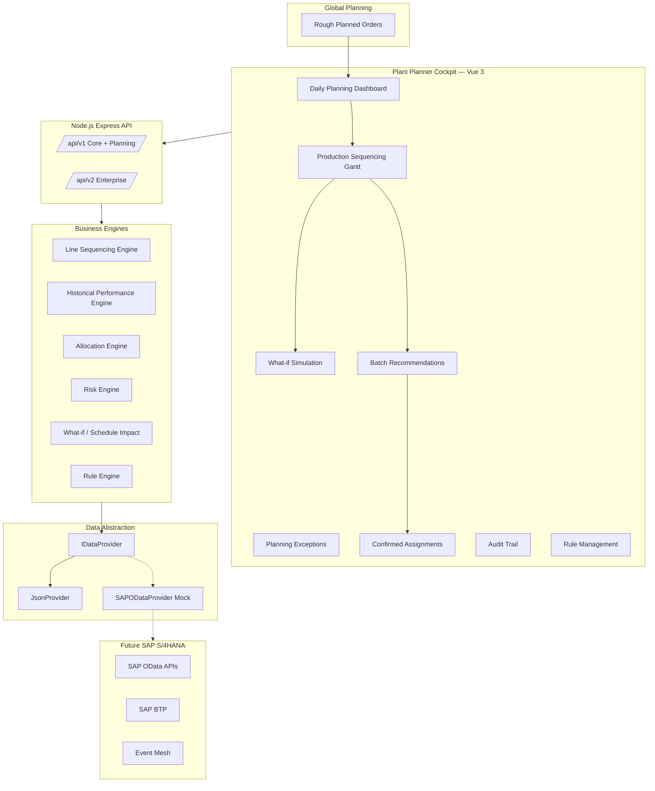

# Enterprise Architecture — Pharmaceutical Allocation & Production Sequencing Platform

## System Context



## Allocation Decision Hierarchy

| Priority | Tier | Rules | Engine |
|----------|------|-------|--------|
| 1 | Compliance | Market Release, Quality, RMSL, Batch Split, Country/Customer rules | `complianceEngine`, `ruleEngine` |
| 2 | Availability | ATP, Reserved, Safety Stock, Quality Stock, Inspection Lot | `inventoryEngine`, `complianceEngine` |
| 3 | Market Rules | Japan Sequence, Customer/Market Priority | `sequencingEngine`, `sequenceValidationEngine` |
| 4 | Inventory Optimization | FEFO, FIFO | `fifoEngine`, `optimizationEngine` |
| 5 | Production Performance | OEE, Throughput, Reliability, Yield, Setup, Downtime | `historicalPerformanceEngine` |
| 6 | Production Optimization | Campaign, Changeover, Utilization, Capacity | `capacityEngine`, `lineSequencingEngine` |
| 7 | Enterprise Optimization | Inventory Risk, Service Level, Market Coverage | `globalOptimizationEngine`, `riskEngine` |

**GMP principle:** Compliance gates are hard stops. Optimization never overrides regulatory failure.

## Sequencing Flow

1. Load rough planned orders from Global Planning
2. Score production lines per material (Historical Performance Engine)
3. Place orders on highest-scoring feasible line
4. Validate TRIC, RMSL, Japan sequence per slot
5. Generate Gantt tasks with expected OEE, throughput, yield
6. What-if re-simulates on drag-drop
7. Confirm sequence → optimized schedule → batch assignment

## Line Score Formula

```
Line Score = 30% OEE + 25% Throughput + 20% Reliability + 15% Yield + 10% Setup Time (inverted)
```

## Risk Engine

Levels: **LOW** | **MEDIUM** | **HIGH**

Factors: eligible batches, RMSL margin, ATP coverage, delivery urgency, market restrictions, batch split restriction, **line reliability**.

## Audit Trail (GMP)

Every allocation decision records: order, sales order, batch, country, rules executed, decision, user, timestamp, **engine version**, rule set version, risk score, packing system reference.

## SAP Integration Layer

All services consume data through `IDataProvider`. Swap `JsonProvider` → `SAPODataProvider` via `HAP_DATA_PROVIDER=sap` without changing business logic.
