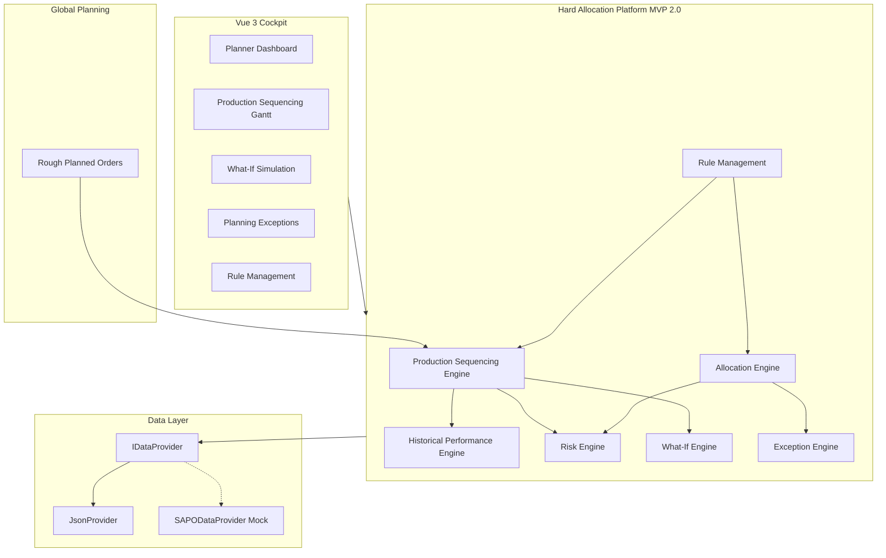

# MVP 2.0 — Production Sequencing & Allocation Optimizer

## Business Objective

Global Planning delivers **rough planned Packaging Orders**. The plant planner uses this platform to:

1. **Sequence** packaging orders on production lines
2. **Select** the best production line (Line Performance Score)
3. **Select** compliant finished goods batches
4. **Optimize** OEE, throughput, and on-time delivery
5. **Minimize** shelf-life (RMSL) and expiry risk
6. **Ensure** regulatory compliance (market release, Japan sequence, batch split)
7. **Confirm** final batch allocation

## System Context



## Core Engines

| Engine | File | Responsibility |
|--------|------|----------------|
| **Production Sequencing** | `engines/lineSequencingEngine.js`, `engines/productionSequencingEngine.js` | Line assignment, capacity, FIFO, Japan sequence, Gantt output |
| **Historical Performance** | `engines/historicalPerformanceEngine.js` | OEE, throughput, reliability, yield, setup → **Line Score** |
| **Risk** | `engines/riskEngine.js` | LOW / MEDIUM / HIGH from RMSL, ATP, batches, delivery, market rules |
| **What-If** | `engines/whatIfEngine.js`, `engines/scheduleImpactEngine.js` | Sequence moves, line changes, batch overrides |
| **Exceptions** | `engines/exceptionEngine.js` | Typed planning & allocation exceptions |
| **Allocation** | `engines/allocationEngine.js` | Compliant batch selection with rule chain |

### Line Performance Score

```
Score = 30% OEE + 25% Throughput + 20% Reliability + 15% Yield + 10% Setup Time
```

Data source: `data/linePerformance.json` (alias: `historicalPerformance.json`)

## API Surface

| API | Prefix | Planner use |
|-----|--------|-------------|
| Planning | `/api/v1/planning/*` | Dashboard, sequence, what-if, confirm, exceptions |
| Performance | `/api/v1/performance/*` | Line scores, recommend line |
| Line Optimization | `/api/v1/line-optimization/*` | Gantt data, optimize, save draft |
| Enterprise | `/api/v2/*` | Rules, exceptions workflow, jobs, copilot, provider |
| Planning Hub | `/api/v5/planning/*` | Timeline, capacity, RMSL risk views |

Key endpoints:

- `GET /api/v1/planning/planner-dashboard` — KPIs + recommendations
- `GET /api/v1/planning/recommended-sequence` — optimized sequence
- `POST /api/v1/planning/what-if` — re-simulate after drag-drop
- `POST /api/v1/planning/confirm-sequence` — confirm plant schedule
- `GET /api/v1/performance/recommend-line?materialNumber=MAT-1000`

## JSON Data Model

| File | Content |
|------|---------|
| `roughPlannedOrders.json` | Input from global planning |
| `productionLines.json` | Packaging lines, capacities |
| `lineCalendars.json` | Shift patterns, downtime |
| `linePerformance.json` | Historical OEE, throughput, reliability |
| `optimizedSchedule.json` | Saved / confirmed sequences |
| `planningExceptions.json` | Capacity, ATP, sequence planning exceptions |
| `exceptions.json` | Allocation exception workflow |
| `rulesV2.json` | Versioned, effective-dated rules |

## SAP Integration Layer

All services consume `IDataProvider`:

- `JsonProvider` — default (`HAP_DATA_PROVIDER=json`)
- `SAPODataProvider` — mock OData (`HAP_DATA_PROVIDER=sap`)

Business logic in `engines/` and `services/` remains SAP-independent.

## Vue Cockpit Pages

| Route | Page | MVP 2.0 capability |
|-------|------|-------------------|
| `/daily-planning` | Planner Dashboard | KPIs, recommendations, utilization |
| `/line-optimization` | Production Sequencing | Drag-drop Gantt, save, confirm |
| `/what-if` | What-If Simulation | Sequence + allocation overrides |
| `/exceptions` | Planning Exceptions | Review, comment, escalate, resolve |
| `/rule-management` | Rule Management | Versioned rules, audit |
| `/simulation` | Batch Recommendations | Compliant batch selection |

Planner terminology mapping: `cockpit/src/utils/plannerTerminology.js`

## Deployment

```bash
# Local
npm install && npm start
cd cockpit && npm install && npm run dev

# Docker
docker compose up --build
```

| Service | Port |
|---------|------|
| API | 8000 (local) / 8001 (Docker) |
| Cockpit | 3001 |

## Test

```bash
npm test          # Smoke + E2E HTTP
npm run test:e2e  # API integration against running server
```
