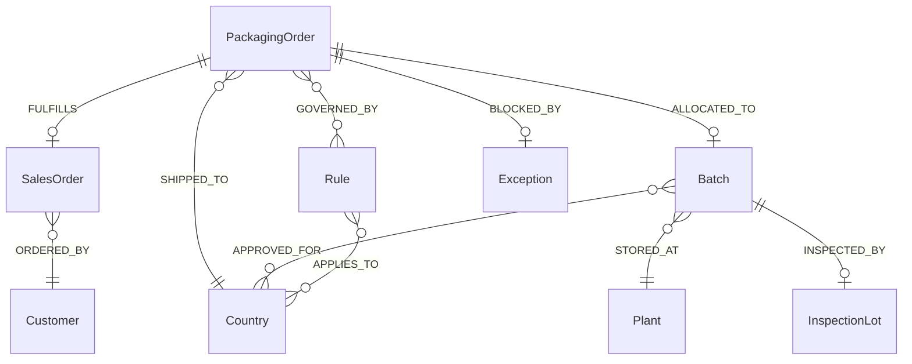

# MVP 3.0 — Knowledge Graph Model (Neo4j)

## 1. Purpose

Unified semantic model connecting orders, batches, markets, rules, and compliance — enabling:
- Copilot graph traversal explanations
- Agent context retrieval
- Impact analysis ("what orders depend on batch X?")

## 2. Node Types

| Label | Key Properties | Source |
|-------|----------------|--------|
| `SalesOrder` | salesOrderId, customer, country, deliveryDate | SAP SD |
| `PackagingOrder` | packagingOrderId, quantity, status, plannedStart | SAP PP / Packing |
| `Batch` | batchId, material, expiry, qualityStatus, rmsl | SAP MM/Batch |
| `Plant` | plantId, name, region | SAP |
| `Market` | marketCode, name | Master data |
| `Country` | countryCode, name | Master data |
| `Customer` | customerId, name, tier | SAP BP |
| `Rule` | ruleId, category, version, effectiveFrom | rulesV2.json |
| `InspectionLot` | lotId, status, releaseDate | SAP QM |
| `Exception` | exceptionId, type, status | Exception Queue |
| `Plant` | plantId | SAP |

## 3. Relationship Types

```cypher
// Allocation flow
(po:PackagingOrder)-[:FULFILLS]->(so:SalesOrder)
(po:PackagingOrder)-[:ALLOCATED_TO]->(b:Batch)
(po:PackagingOrder)-[:SHIPPED_TO]->(c:Country)
(so:SalesOrder)-[:ORDERED_BY]->(cust:Customer)

// Compliance
(b:Batch)-[:APPROVED_FOR]->(c:Country)          // TRIC
(b:Batch)-[:STORED_AT]->(p:Plant)
(b:Batch)-[:INSPECTED_BY]->(il:InspectionLot)
(b:Batch)-[:BLOCKED_BY]->(e:Exception)

// Rules
(r:Rule)-[:APPLIES_TO]->(c:Country)
(r:Rule)-[:APPLIES_TO]->(m:Market)
(po:PackagingOrder)-[:GOVERNED_BY]->(r:Rule)

// Dependencies
(po1:PackagingOrder)-[:DEPENDS_ON]->(po2:PackagingOrder)  // Japan sequence
(b:Batch)-[:REPLACES]->(b2:Batch)                          // FIFO chain
```

## 4. Sample Cypher Queries

### Why was Batch B002 selected?
```cypher
MATCH (po:PackagingOrder {packagingOrderId: $orderId})-[:ALLOCATED_TO]->(b:Batch)
MATCH (b)-[:APPROVED_FOR]->(c:Country)<-[:SHIPPED_TO]-(po)
MATCH (r:Rule)-[:APPLIES_TO]->(c)
RETURN po, b, c, collect(r) AS rules
```

### Markets at risk (RMSL < threshold in 30 days)
```cypher
MATCH (b:Batch)-[:APPROVED_FOR]->(c:Country)
MATCH (r:Rule {category: 'RMSL'})-[:APPLIES_TO]->(c)
WHERE b.expiryDate <= date() + duration('P30D')
RETURN c.countryCode, count(b) AS atRiskBatches
```

### Japan sequence dependency chain
```cypher
MATCH path = (po:PackagingOrder)-[:DEPENDS_ON*]->(prev:PackagingOrder)
WHERE po.destinationCountry = 'JP'
RETURN path ORDER BY po.plannedStartDate
```

## 5. Graph Schema Diagram



## 6. Sync Strategy

| Mode | Frequency | Use |
|------|-----------|-----|
| Full sync | Nightly | Rebuild from SAP |
| Incremental | Event-driven | Kafka/Mesh events |
| On-demand | API trigger | After allocation execute |

## 7. MVP 3.0 Implementation

- **Production target:** Neo4j 5.x with Cypher
- **MVP scaffold:** `knowledge-graph/graphRepository.js` — in-memory graph mimicking Neo4j API
- **Schema file:** `knowledge-graph/schema.cypher`

## 8. GMP Data Integrity

- Graph is **read replica** of SAP truth; SAP remains system of record
- Graph sync lag monitored; stale data flag on agent recommendations
- TRIC and quality status always verified against SAP before execution
