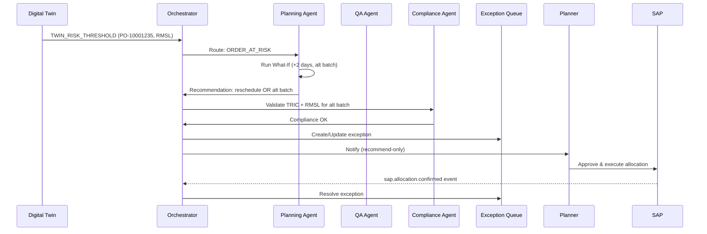
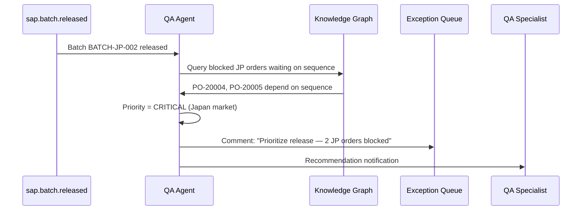

# MVP 3.0 — Multi-Agent Workflow

## 1. End-to-End Scenario: Blocked Order Resolution

**Trigger:** Planning Agent detects RMSL violation for PO-10001235 in T+7 twin projection



## 2. QA Agent Workflow: Inspection Lot Prioritization



## 3. Supply Chain Agent: Inventory Rebalancing

```mermaid
sequenceDiagram
    participant Twin as Twin T+30
    participant SC as Supply Chain Agent
    participant Opt as Optimization Engine
    participant Exec as Executive Cockpit

    Twin->>SC: CH surplus 15k EA, JP shortage 4k EA
    SC->>Opt: Optimize redistribution (min expiry, max service)
    Opt->>SC: Move 5000 EA MAT-1000 CH→JP plant
    SC->>Exec: Recommendation card
    Note over SC,Exec: Requires Supply Chain Manager approval
```

## 4. Orchestrator State Machine

```
States:
  IDLE → TRIGGERED → ROUTING → AGENT_RUNNING → MERGING
       → COMPLIANCE_GATE → AWAITING_APPROVAL → COMPLETED

Transitions:
  TRIGGERED: event or schedule
  ROUTING: classify trigger type
  AGENT_RUNNING: one or more agents parallel
  MERGING: deduplicate recommendations
  COMPLIANCE_GATE: Compliance Agent validates
  AWAITING_APPROVAL: human required if confidence < 0.9 or CRITICAL
  COMPLETED: audit logged
```

## 5. Agent Priority Matrix

| Trigger | Primary Agent | Secondary | SLA |
|---------|---------------|-----------|-----|
| RMSL risk | Planning | Compliance | 4h |
| TRIC gap | Compliance | Planning | 8h |
| Quality block | QA | Planning | 2h |
| Inventory imbalance | Supply Chain | Planning | 24h |
| Japan sequence | Planning | Compliance | 1h |
| User question | Copilot | — | 3s |

## 6. Conflict Resolution

When agents disagree:
1. Compliance Agent veto on regulatory issues
2. Higher confidence wins (non-regulatory)
3. Escalate to human if tie

## 7. Implementation Reference

See `agents/orchestrator.js` for MVP 3.0 scaffold implementing this state machine in Node.js (LangGraph-compatible interface).
