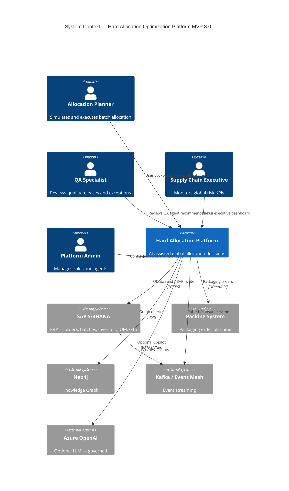
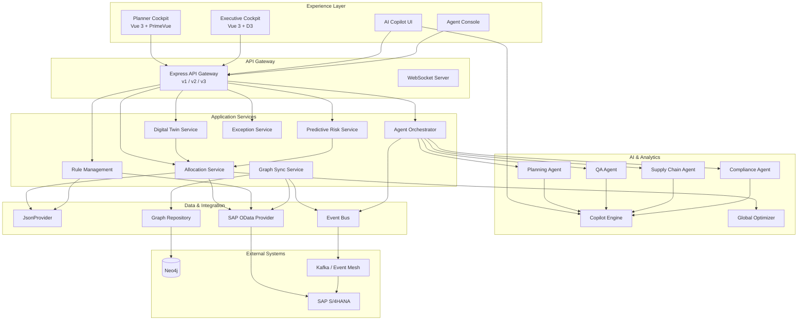
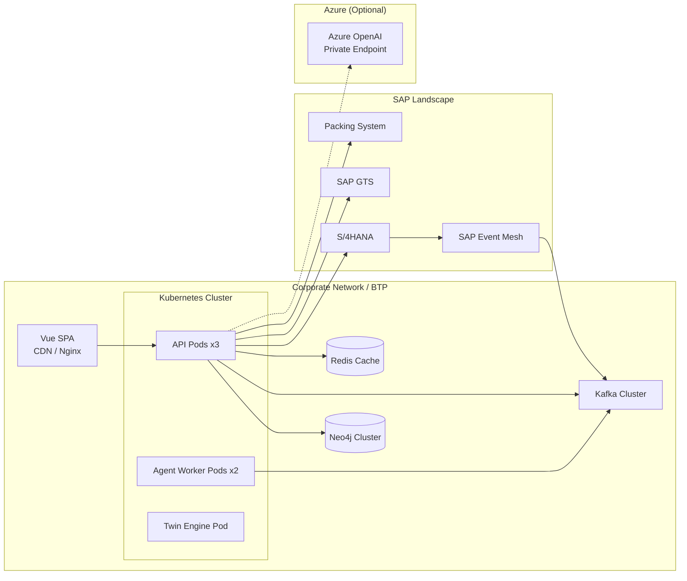

# MVP 3.0 — Complete System Landscape

## 1. System Context Diagram (C4 Level 1)



## 2. Container Diagram (C4 Level 2)



## 3. Deployment Landscape



## 4. Data Flow — Allocation Decision

```
1. SAP Event: packaging_order.released
2. Event Bus → Twin Sync + Graph Sync
3. Planning Agent (scheduled): scan T+7 projections
4. Risk detected → What-If simulations
5. Recommendation → Exception Queue + Agent Console
6. Planner reviews in Copilot ("Why blocked?")
7. Planner approves → Execute allocation
8. SAP BAPI confirm → Event → Graph update
9. Executive Dashboard KPI refresh
```

## 5. Technology Inventory

| Component | MVP 1 | MVP 2 | MVP 3 | MVP 5 |
|-----------|-------|-------|-------|-------|
| Backend | Node.js | + v2 API | + v3, agents | Validated |
| Frontend | React/Vue | Vue Cockpit | + Executive | Fiori embed |
| Data | JSON | + Provider | + Graph, Twin | HANA |
| AI | — | Rule Copilot | Multi-agent | Governed LLM |
| Events | — | — | Kafka shadow | Production |
| SAP | — | Mock | OData read | Full integration |

## 6. Network & Security Zones

| Zone | Components | Access |
|------|------------|--------|
| DMZ | Cockpit CDN, API Gateway | HTTPS public (auth) |
| App | Services, Agents | Internal only |
| Data | Neo4j, Kafka, Redis | App tier only |
| SAP | S/4, GTS | SAP router / BTP destination |
| AI | Azure OpenAI | Private endpoint, no PII |

## 7. Document Index

| # | Document |
|---|----------|
| 1 | [01-ENTERPRISE-ARCHITECTURE.md](./01-ENTERPRISE-ARCHITECTURE.md) |
| 2 | [02-AI-AGENT-ARCHITECTURE.md](./02-AI-AGENT-ARCHITECTURE.md) |
| 3 | [03-KNOWLEDGE-GRAPH-MODEL.md](./03-KNOWLEDGE-GRAPH-MODEL.md) |
| 4 | [04-EVENT-DRIVEN-ARCHITECTURE.md](./04-EVENT-DRIVEN-ARCHITECTURE.md) |
| 5 | [05-SAP-INTEGRATION-ARCHITECTURE.md](./05-SAP-INTEGRATION-ARCHITECTURE.md) |
| 6 | [06-EXECUTIVE-COCKPIT-DESIGN.md](./06-EXECUTIVE-COCKPIT-DESIGN.md) |
| 7 | [07-AI-COPILOT-DESIGN.md](./07-AI-COPILOT-DESIGN.md) |
| 8 | [08-MULTI-AGENT-WORKFLOW.md](./08-MULTI-AGENT-WORKFLOW.md) |
| 9 | [09-ROADMAP-MVP3-TO-MVP5.md](./09-ROADMAP-MVP3-TO-MVP5.md) |
| 10 | This document |
