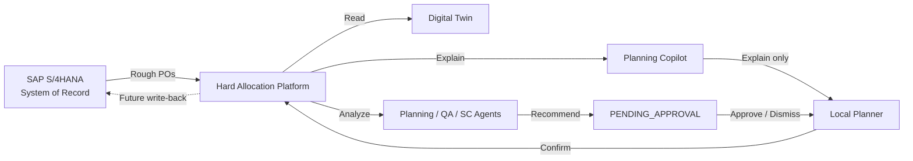

# MVP 3.0 — AI-Assisted Planning Platform (Master Deliverables)

**Mission:** Transform the Production Sequencing & Allocation Optimizer into an **AI-assisted advisory platform**. The AI explains, detects risks, and recommends — the **human planner remains the final approver**.

**Principle:** GMP-compliant decision support. No autonomous allocation. Full evidence trail.

---

## Governance Model



| Role | Authority |
|------|-----------|
| Planning Agent | Recommends reschedule, alternate batch, RMSL escalation |
| QA Agent | Recommends inspection lot prioritization |
| Supply Chain Agent | Recommends transfers, expiry mitigation |
| Compliance Agent | Flags predicted RMSL violations |
| Planner / QA / SC | **Approves or dismisses** every recommendation |
| Copilot | **Explains only** — never executes |

---

## Deliverable 1 — Enterprise Architecture

**Reference:** [01-ENTERPRISE-ARCHITECTURE.md](./01-ENTERPRISE-ARCHITECTURE.md), [10-SYSTEM-LANDSCAPE.md](./10-SYSTEM-LANDSCAPE.md)

| Layer | Components |
|-------|------------|
| **Experience** | Vue 3 Cockpit — Daily Planning, Line Optimization, Executive, Agents, Copilot |
| **API** | Express REST `/api/v1`–`v5`, Swagger, WebSocket Control Tower |
| **Intelligence** | Agents, Copilot, Twin, Predictive Risk, Historical Performance |
| **Domain** | Allocation, Sequencing, Rules Engine, What-If |
| **Data** | `IDataProvider` — JSON (pilot) → SAP OData (production) |
| **Graph** | In-memory graph → Neo4j (MVP 3.1) |
| **Events** | In-memory bus → Kafka / SAP Event Mesh (MVP 4+) |

**Business flow:** Global Planning sends rough Packaging Orders → Local planner sequences lines, allocates compliant inventory, manages RMSL/Japan sequence risks → AI advisors surface exceptions early.

---

## Deliverable 2 — AI Copilot Architecture

**Reference:** [07-AI-COPILOT-DESIGN.md](./07-AI-COPILOT-DESIGN.md)  
**Runtime:** `engines/copilotEngine.js`, `services/copilotService.js`, `POST /api/v3/copilot/ask`

### Supported Questions

| Question | Intent | Evidence Sources |
|----------|--------|------------------|
| Why is this order blocked? | `BLOCKED_ORDER` | Rule checks, exceptions, allocation result |
| Why was this batch selected? | `BATCH_SELECTION` | FIFO, TRIC, RMSL, quality status |
| Why was this line recommended? | `LINE_RECOMMENDATION` | OEE, throughput, reliability, yield, setup |
| What happens if I move this order? | `MOVE_ORDER` | Capacity, delivery date impact |
| What happens if I use another batch? | `ALTERNATE_BATCH` | Compliance delta, risk score |
| What happens if I move to another line? | `ALTERNATE_LINE` | Line score comparison |

### Explanation Pattern

Every answer returns:

```json
{
  "intent": "BATCH_SELECTION",
  "answer": "Business narrative for the planner",
  "evidence": ["Market Release approved for DE", "RMSL 18.2 mo above threshold 12 mo"],
  "advisorNote": "Explanation only — planner retains final approval.",
  "suggestedQuestions": ["..."]
}
```

**MVP 3.0:** Internal reasoning engine (deterministic, auditable).  
**MVP 3.1+:** Hybrid LLM for natural language — rules engine remains source of truth.

---

## Deliverable 3 — Planning Agent Design

**Reference:** [02-AI-AGENT-ARCHITECTURE.md](./02-AI-AGENT-ARCHITECTURE.md)  
**Runtime:** `agents/planningAgent.js`, `GET /api/v3/agents/morning-briefing`

### Morning Data Sources

1. Packaging Orders  
2. Inventory / Batches  
3. Quality Stock  
4. Inspection Lots  
5. Line Calendars  
6. Historical Performance  
7. Digital Twin T+7 projection  

### Daily Planning Summary (example with 52 orders)

```json
{
  "summary": {
    "openOrders": 52,
    "allocatableOrders": 47,
    "ordersAtRisk": 5,
    "inventoryRisks": 2,
    "japanSequenceRisks": 1,
    "recommendedActions": 6
  }
}
```

### Recommendation Types

- `RESCHEDULE_OR_ALT_BATCH` — twin projects allocation failure  
- `ESCALATE_RMSL` — open RMSL planning exceptions  

---

## Deliverable 4 — QA Agent Design

**Runtime:** `agents/qaAgent.js`

| Responsibility | Action |
|----------------|--------|
| Review inspection lots (PENDING / IN_PROGRESS) | `PRIORITIZE_RELEASE` |
| Link lot → blocked packaging order | Impact: "Will unblock PO-20xxx" |
| Quality exceptions | `QA_REVIEW` |

**Example output:**

> Inspection Lot IL-90001 — Expected release: tomorrow  
> Recommendation: Prioritize QA Release  
> Impact: Will unblock Order PO-20015  

Approver role: **QA**

---

## Deliverable 5 — Supply Chain Agent Design

**Runtime:** `agents/supplyChainAgent.js`

| Monitor | Recommendation |
|---------|----------------|
| At-risk markets (twin) | `INVENTORY_REBALANCE` |
| Japan forecast gap | `MARKET_TRANSFER` — e.g. 10,000 EA from CH |
| Expiring batches (< 3 mo RMSL) | `EXPIRY_RISK` |

Approver role: **SUPPLY_CHAIN**

---

## Deliverable 6 — Digital Twin Architecture

**Reference:** `docs/control-tower/06-DIGITAL-TWIN-DESIGN.md`  
**Runtime:** `engines/digitalTwinEngine.js`, `GET /api/v3/twin/simulate?horizon=7|30|90`

### Simulated Entities

Orders · Inventory · Markets · Lines · Batches · Inspection Lots (via linked data)

### Projections

| Horizon | Questions Answered |
|---------|------------------|
| T+7 | Which orders fail RMSL? Which markets at risk? Line utilization? |
| T+30 | Expiry clusters, capacity pressure |
| T+90 | Strategic inventory exposure |

### KPIs from Twin

- `projectedSuccess` / `projectedFailed`  
- `peakUtilization` / `averageUtilization` per line  
- `atRiskMarkets` heatmap  

---

## Deliverable 7 — Knowledge Graph Model

**Reference:** [03-KNOWLEDGE-GRAPH-MODEL.md](./03-KNOWLEDGE-GRAPH-MODEL.md)  
**Runtime:** `knowledge-graph/graphRepository.js` (in-memory), `knowledge-graph/schema.cypher` (Neo4j)  
**API:** `GET /api/v3/graph/stats`

### Nodes

PackagingOrder · SalesOrder · Batch · Plant · Market · Country · Customer · Line · InspectionLot · Rule

### Relationships

| Type | Meaning |
|------|---------|
| `ALLOCATED_TO` | Order → Batch |
| `APPROVED_FOR` | Batch → Country (TRIC) |
| `PRODUCED_ON` | Order → Line |
| `BLOCKED_BY` | Order → InspectionLot |
| `FULFILLS` | Order → SalesOrder |
| `SHIPPED_TO` | Order → Country |
| `GOVERNED_BY` | Country → Rule |
| `INSPECTS` | InspectionLot → Batch |

**Production path:** `docker-compose.mvp3.yml` → Neo4j 5.x + Bolt driver (MVP 3.1).

---

## Deliverable 8 — Event Driven Architecture

**Reference:** [04-EVENT-DRIVEN-ARCHITECTURE.md](./04-EVENT-DRIVEN-ARCHITECTURE.md)  
**Runtime:** `events/eventService.js`, `GET /api/v3/events/log`

### Topics (Kafka / SAP Event Mesh ready)

| Topic | Events |
|-------|--------|
| `hap.agents.run` | Agent orchestration completed |
| `hap.recommendations` | Approve / dismiss |
| `hap.allocation` | Simulation, confirmation |
| `hap.inventory` | Batch release, transfer |
| `hap.qa` | Inspection lot status |
| `hap.sap.events` | Future SAP Event Mesh bridge |

**Configuration:** `HAP_EVENT_BUS=memory` (default) or `kafka` (Redpanda in compose overlay).

### Future Triggers

| SAP / Kafka Event | Agent Trigger |
|-------------------|---------------|
| Batch released | `BATCH_RELEASED` → QA Agent |
| Inventory imbalance | `INVENTORY_IMBALANCE` → SC + Planning |
| Order blocked | `ORDER_BLOCKED` → Planning + Compliance |

---

## Deliverable 9 — Executive Dashboard Design

**Reference:** [06-EXECUTIVE-COCKPIT-DESIGN.md](./06-EXECUTIVE-COCKPIT-DESIGN.md)  
**UI:** `/executive` — `ExecutiveCockpitView.vue`  
**API:** `GET /api/v3/executive/dashboard`

### KPIs

| KPI | Source |
|-----|--------|
| Service Level | On-time planned end vs requested delivery |
| Inventory Risk | Expiring batches + predictive horizon |
| RMSL Compliance | Inverse of orders at risk |
| Inventory Exposure | Released batch available quantity |
| Allocation Success Rate | Twin projected success % |
| Line Utilization | Twin peak line utilization % |
| Global Risk | Predictive Risk Engine overall score |

### Management Actions

- View agent recommendations  
- Approve / dismiss with audit trail  
- Run multi-agent orchestration  
- Switch risk horizon 7 / 30 / 90 days  

---

## Deliverable 10 — Node.js Implementation Approach

**Reference:** [13-NODE-IMPLEMENTATION-APPROACH.md](./13-NODE-IMPLEMENTATION-APPROACH.md)

**Hub service:** `services/intelligenceService.js`

```
IntelligenceService
├── DigitalTwinEngine
├── PredictiveRiskEngine
├── GlobalOptimizationEngine
├── HistoricalPerformanceEngine
├── AgentOrchestrator → Planning, QA, SC, Compliance
├── GraphRepository (seeded at startup)
├── CopilotService → CopilotEngine
└── EventService (publish on agent run / approval)
```

**API surface:** `routes/v3/index.js` — 15 endpoints, RBAC via `middleware/auth.js`.

**Data:** `providers/JsonProvider.js` — swap to `SAPODataProvider` via `HAP_DATA_PROVIDER=sap`.

**Persistence:** `data/agentRecommendations.json` — human approval workflow.

---

## Deliverable 11 — Vue.js UI Design

**Reference:** [14-VUE-UI-DESIGN.md](./14-VUE-UI-DESIGN.md)

| Route | Purpose | Key Components |
|-------|---------|----------------|
| `/daily-planning` | Planner KPIs + recommendations | KPI cards, exception list |
| `/line-optimization` | Gantt sequencing | Drag-drop bars, Save Draft |
| `/executive` | Management cockpit | KPI grid, heatmap, approve/dismiss |
| `/agents` | Morning briefing + agent run | Summary, orchestrator, graph stats |
| `/copilot-v3` | Planning Copilot | Chat, suggested questions |

**Stack:** Vue 3 + Vite + PrimeVue + Chart.js + enterprise Fiori theme.

---

## Deliverable 12 — Roadmap MVP 3.0 → MVP 5.0

**Reference:** [09-ROADMAP-MVP3-TO-MVP5.md](./09-ROADMAP-MVP3-TO-MVP5.md)

| Release | Focus |
|---------|-------|
| **MVP 3.0** ✅ | Advisory agents, copilot, twin, executive dashboard, JSON data |
| **MVP 3.1** | Neo4j production, Azure OpenAI hybrid, WebSocket agent push, scheduled daily runs |
| **MVP 4.0** | SAP OData read, Kafka production, OR-Tools optimizer, LangGraph workflows |
| **MVP 4.5** | SAP write-back, Event Mesh production |
| **MVP 5.0** | GxP validation, 21 CFR Part 11, CSV package |

---

## Quick Start

```bash
npm run generate:data    # 52 orders, 96 batches
npm start                # API :8000
cd cockpit && npm run dev  # UI :3001
npm test                 # 67 checks incl. v3
```

### Key API Calls

```bash
# Morning briefing
curl http://localhost:8000/api/v3/agents/morning-briefing -H "X-User-Role: PLANNER"

# Run all agents
curl -X POST http://localhost:8000/api/v3/agents/run \
  -H "Content-Type: application/json" -H "X-User-Role: PLANNER" \
  -d '{"trigger":"SCHEDULED_DAILY","horizonDays":7}'

# Copilot
curl -X POST http://localhost:8000/api/v3/copilot/ask \
  -H "Content-Type: application/json" -H "X-User-Role: PLANNER" \
  -d '{"question":"Why was this line recommended?","packagingOrderId":"PO-20001"}'
```

---

## GMP / Compliance Statement

- MVP 3.0 is **not GxP validated** — decision support only  
- Every recommendation: `requiresApproval: true`, `evidence[]`, `approverRole`  
- Copilot cites rule checks — no black-box decisions  
- SAP remains system of record until MVP 4.5 write-back  
- Full audit in `agentRecommendations.json` + rule audit log (MVP 2)
